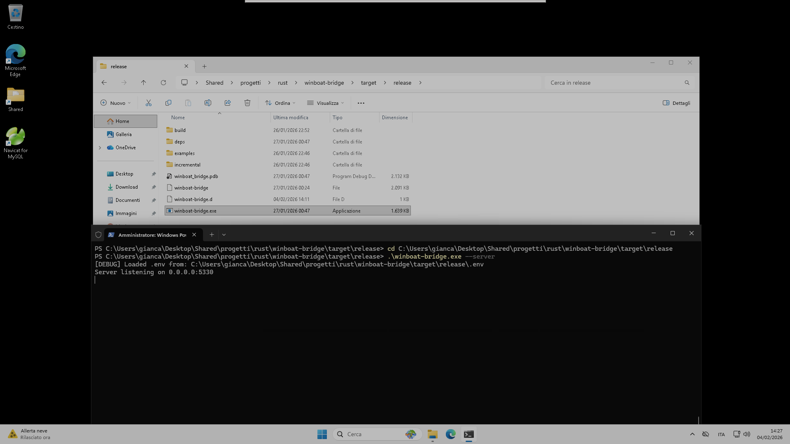
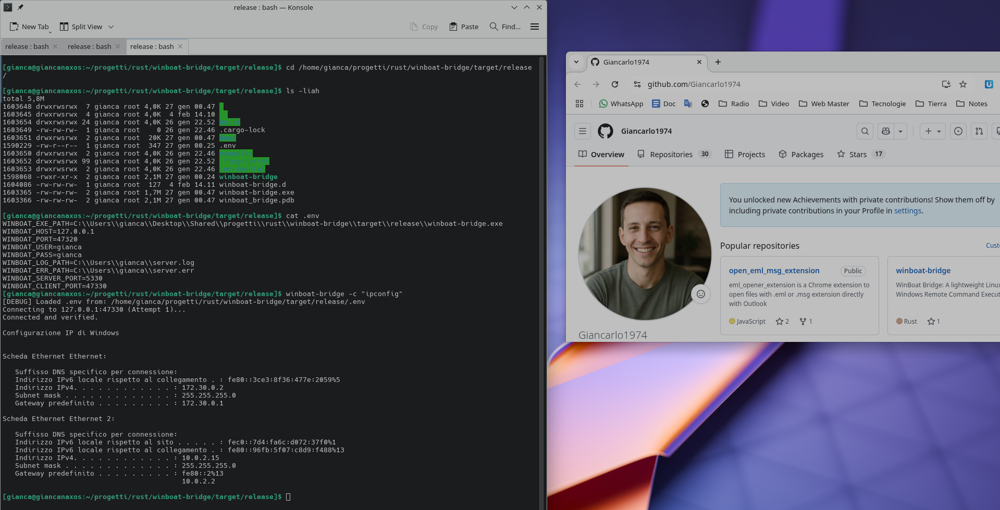

# WinBoat Bridge – Quickstart for Binary Users

This quick guide is for people who want to download the ready-made binaries and run WinBoat Bridge without building from source.

## 1. Check your Docker Compose ports

Make sure your running `docker-compose` exposes the right ports. Run:

```bash
cat ~/.winboat/docker-compose.yml
```

Confirm it includes something like:

```yaml
services:
  windows:
    ports:
      - "127.0.0.1:47320:5985"  # WinRM access
      - "127.0.0.1:47330:5330"  # WinBoat Bridge server
```

This maps the Windows container’s port `5330` to host port `47330`, so the Linux client can reach the server.

After changing the compose file, reload the container:

```bash
cd ~/.winboat
docker compose restart
```

## 2. Set up the Windows server

1. Download `winboat-bridge.exe` for Windows from the [GitHub Releases page](https://github.com/Giancarlo1974/winboat-bridge/releases).
2. Copy it into the shared folder used by the Windows VM, for example:

   ```text
   /home/gianca/Desktop/Shared/progetti/rust/winboat-bridge/target/release/winboat-bridge.exe
   ```

3. This exact path is what you will reference in the `.env` file later.
4. Start the Windows binary with PowerShell and `--server`, then make sure it listens on `0.0.0.0:5330` as shown in the screenshot.



## 3. Set up the Linux client

1. Download the Linux binary `winboat-bridge` from the same [Releases page](https://github.com/Giancarlo1974/winboat-bridge/releases).
2. Move it to `/usr/local/bin` or another folder already in your `PATH`.
3. Make it executable:

   ```bash
   chmod +x /usr/local/bin/winboat-bridge
   ```

4. Keep in mind the client uses port `47330` to talk to the server on port `5330`, so those settings must match your docker-compose mapping.

## 4. Configure `.env`

1. Open `.env` for editing:

   ```bash
   nano .env
   ```

2. Replace the values with your setup (change paths if needed):

   ```bash
   WINBOAT_EXE_PATH=C:\\Users\\gianca\\Desktop\\Shared\\progetti\\rust\\winboat-bridge\\target\\release\\winboat-bridge.exe
   WINBOAT_HOST=127.0.0.1
   WINBOAT_PORT=47320
   WINBOAT_USER=gianca
   WINBOAT_PASS=gianca
   WINBOAT_LOG_PATH=C:\\Users\\gianca\\server.log
   WINBOAT_ERR_PATH=C:\\Users\\gianca\\server.err
   WINBOAT_SERVER_PORT=5330
   WINBOAT_CLIENT_PORT=47330
   ```


## 5. Run Windows commands from Linux

Once the client is installed, use it to run commands on the Windows side:

```bash
winboat-bridge -c "ipconfig"
```

Or run any other command, for example:

```bash
winboat-bridge -c "dir"
```

## 6. Support the project (aka "The Star Section" ⭐)

Building tools like this is fun, but seeing stars is better! 

If this tool saved you time or just made your life easier, please **drop a star** on this repository. It costs you $0.00, but it gives me the fuel (and the dopamine) to keep building and sharing more cool stuff for free. 

Go on, click that star. You know you want to! 😉
